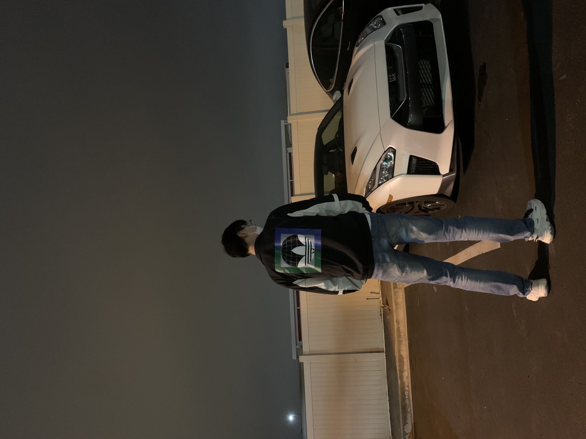

# [go directly to intro](#intro)

<h1 style="text-align:center">Introduction of Myself </h1>

> *That which does not kill us makes us stronger -- Friedrich Nietzsche*

## Intro:
### I'm  **Zichen Zhou**, Current undergraduate student at *university of California, San Diego*, major in Computer Engineering.  Nerd and super interested in the **_software engineering_**. Familiar with academic inquiry, collaborative open‑source programming through participation in various VLSI projects via Prof.Cheng, and is fluent in Java, c++, c, ~~Python~~ programming language. 
### Here is my [LinkedIn link.](https://www.linkedin.com/in/zichen-zhou-556a90247/)

## Skills: 
### Proficient:  
- Java
- C++
- C
- Arm
### Familiar:
1. Python
2. Javascript
3. Perl
4. SQL

## Projects:
1. Standard Cell Synthesis for Emerging Cell Architectures
   - Ongoing VLSI Project, [github page](https://github.com/ASHZHOU02/smt.git)
   - Co‑Designing Perl programs to concurrent transistor placement and routing based on input schematic of cell logic and layout specification, to output the Optimized CFET cell layout.
   - Program is able to take in basic Netlist information and Cell Architecture data, convert design rule constrains into SMT problem using Perl Script
program, and use z3 SMT solver to find practical layout solution that Optimize Cell Size, Routability, and Total Metal Length.
    - Read and inquire into abundant research papers for background VLSI knowledge, translate various mathematical constrains, design rules into Perl program Conditioning, and work collaborative with master colleague in open source github programming and debugging.
    - Involving variables: 
    ```
    $BoundaryCondition, $SON, $MAR_Parameter, $PRL_Parameter, $gearRatio (formal $dint)
    ```
2. Huffman Coding Compression
   - Implement c++ program to compress and decompress given file using Huffman Coding algorithm.
   - Using Huffman Coding, which converts data each into variable‑length prefix bits based on the frequency, program is able to compress any input file, text, image, video, reducing up to 20% storage size, and decompress encoded binary file.
   - Familiarize myself with C++ programming grammar, gdb debugging process, and binary data analysis via implementation of Huffman coding model and various data structures.

## Personal FunFact:
### hobby in Music (piano), gaming, biking. After graduating high school, ride bicycle in #318 national highway (in China), from Chengdu, Sichuan to Lhasa, Tibet. Total length 1334 miles.
- ### [Image 1](Biking/2.jpg)
- ### [Image 2](Biking/3.jpg)
- ### [Image 3](Biking/4.jpg)
### Wishes This Fall
- [ ] Get to Platinum rank in LOL
- [ ] Get one 2023 Summer Intern Offer
- [X] Be happy


 


